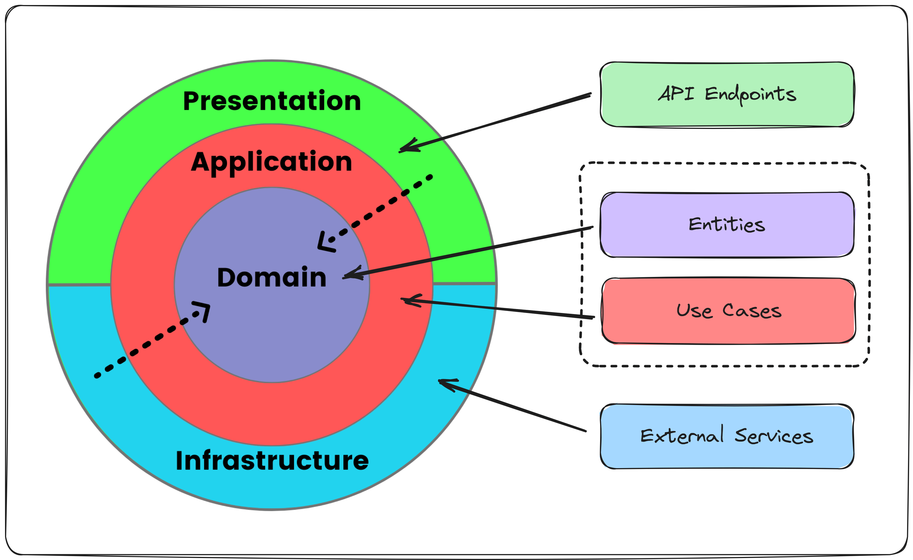

## Solution Structure

The solution is split up into four main application projects:
* Domain
* Application
* Infrastructure
* Web

which represent high-level interpretation of Clean Architecture consisting of four layers:
* Domain
* Application
* Infrastructure
* Presentation

A cornerstone of Clean Architecture is the implementation of the Dependency Inversion Principle at the architectural level. 
Within this paradigm, the Domain stands autonomous, while the Application both depends on it and defines abstractions upon which the Infrastructure is anchored.
Consequently, the Presentation layer achieves loose coupling with the Infrastructure, as it leans on the abstractions outlined in the Application layer. This is further enhanced by careful service provider registration and precise service resolution.

Such an architectural design guarantees:
- Enhanced maintainability,
- Robust testability,
- A framework characterized by loose coupling,
- And a clear separation of concerns.